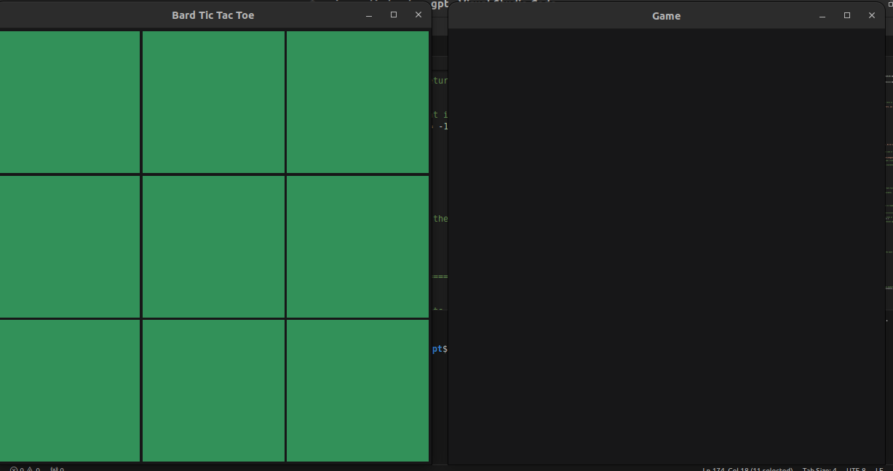
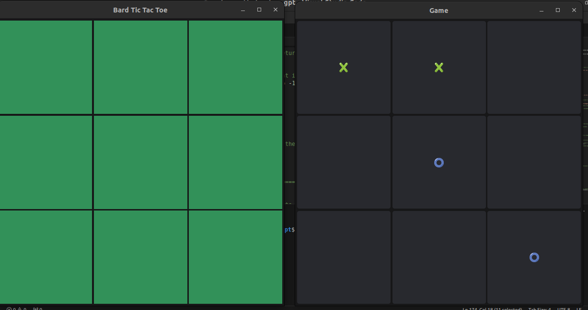

## Tic-Tac-Toe with Bard
### Introduction
A Golang implementation for a simple tic-tac-toe with Google's chatbot Bard. 
### Tech Stack
1. Golang 1.21.5.
2. fyne v2.4.2, [Link](https://fyne.io/)
3. Gobard, [Link](https://github.com/aquasecurity/gobard)
### Screenshots
#### Game Start

#### Gameplay

### How to play
1. Install 'Golang v1.21.5' or higher
2. Clone the repository
3. Open 'main.go' and replace variables 'cookie_1' and 'cookie_2' using the instructions [here](https://github.com/aquasecurity/gobard?tab=readme-ov-file#obtain-a-bard-cookie)
4. Run 'go mod tidy'
5. Run 'go run .'
6. Enjoy :) 
